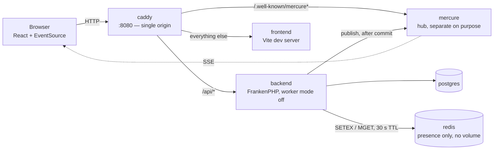

# Instant Messaging

A real-time messaging application built with PHP/Symfony, Mercure and React.

This is a **portfolio project**: architectural quality is the goal, delivery speed is not.
Every non-obvious decision is written down with the reasoning that produced it — in
[`docs/adr/`](docs/adr/) for cross-cutting choices, in [`docs/superpowers/specs/`](docs/superpowers/specs/)
for per-slice ones. Most of the code is commented in French; this README is the one
exception.

---

## What this project demonstrates

**The Mercure hub stays a separate service.** This is the central lesson of the project, and
the reason it exists. FrankenPHP can host a Mercure hub in-process — and that is precisely
what is *not* done here. The hub is a long-lived, stateful, connection-holding process; PHP
request handling is shared-nothing and dies with the response. Fusing them would blur the two
lifecycles that the whole design is meant to keep apart. For the same reason, **FrankenPHP's
worker mode is deliberately disabled**: one process per request, consistent with the premise
that justifies the hub in the first place.

**Hexagonal architecture per bounded context, with CQS.** Five contexts — `Identity`,
`Conversation`, `Message`, `Realtime`, `Shared` — each split into `Domain` (pure PHP, zero
Composer packages, not even `symfony/uid`), `Application` and `Infrastructure`. The dependency
rule runs one way only, and `deptrac` fails the build on any violation, across two dimensions:
technical layers and context boundaries.

**`Application` knows no vendor code, except `Psr\*`.** No `Symfony\`, no `Doctrine\`, no
`Monolog\`. A use case states its need as a port; `Infrastructure` fulfils it. PSR interfaces
are normalised contracts, so depending on them binds nothing to a framework.

**Contexts communicate through published contracts, never internals.** Reads go through a
published `{Thing}FinderInterface` returning a `{Thing}View` — never an aggregate. Writes are
choreographed: a context publishes a fact, the interested party reacts with its own command.
`Message` never writes to the `conversations` table. See
[ADR 0001](docs/adr/0001-cross-context-communication.md).

**DBAL and hand-written SQL, no ORM.** `doctrine/orm` is not installed and will not be.
Repositories are written by hand, mappers are explicit, migrations are literal SQL. Queries
live whole in the repository or reader that uses them, so any one of them can be pasted
straight into `psql`. PostgreSQL is assumed: `ON CONFLICT`, `RETURNING` and partial indexes
are welcome, portability is not a goal.

**Every API error is an RFC 7807 Problem Details document**, served as
`application/problem+json`, carrying the same `correlation_id` as the logs. A non-member gets
**404, not 403** — a 403 would confirm that the conversation exists, handing out an
enumeration oracle.

**Durable state and ephemeral state are told apart, and stored differently.** Read receipts
are durable: two watermark columns on `conversation_members`, moved forward by a guarded
`UPDATE` whose `WHERE` makes monotonicity structural — a cursor can never go backwards, not
even under two concurrent tabs. Presence and typing are ephemeral: a Redis key with a TTL for
one, a bare Mercure event for the other, and **not a single database row for either**. The
migration that ships slice 2 adds two columns and nothing else — that absence is the argument.
A persisted `is_online` boolean turns false on the first crash and is never reset; an
expiring key is self-healing by construction.

**Frontend logic lives outside React.** Deduplication, optimistic reconciliation and ULID
ordering are a pure reducer, testable by calling a function. The `EventSource` has exactly one
owner. Components are kept as dumb as possible.

---

## Architecture

Everything is served from a single origin, `http://localhost:8080`. Nothing else is published:
the backend, the hub and Vite are reachable only from inside the Docker network. Same origin
means the `mercureAuthorization` cookie set by the backend is sent to the hub with no CORS and
no `SameSite=None`.



The sixth container, `redis`, holds **no durable data** and has **no volume, deliberately**.
Presence that survived a restart would claim people are online when nobody knows that any
more; Redis comes back empty, and each client's next heartbeat rebuilds the whole picture in
under 20 seconds.

A message travels like this: the browser `POST`s it, the command handler persists it and
records a domain event, the transactional middleware dispatches that event **after the commit**
— publishing inside the transaction would push clients a message a rollback could erase — and a
single `publish` reaches the hub, which fans out. The business path stays O(1) regardless of
how many subscribers a conversation has.

Two contracts the frontend depends on: the Mercure event `id` is the message's ULID, so
`Last-Event-ID` will be usable later without a format change; and the `message.created` payload
carries `client_message_id`, the only key by which the sender reconciles its optimistic echo —
the SSE event routinely arrives before the `POST` response.

```
backend/src/<Context>/
├── Domain/           # pure PHP: entities, value objects, ports, domain events
├── Application/      # Command/ and Query/ with their handlers and ports
└── Infrastructure/   # Http/, Persistence/ — the adapters

frontend/src/
├── store/            # pure reducer: dedup, optimistic reconciliation, ULID order
├── realtime/         # RealtimeClient, sole owner of the EventSource
├── api/              # typed HTTP client
├── hooks/            # React binding
└── ui/               # components
```

---

## Requirements

- Docker, with the Compose plugin
- GNU Make
- `openssl` (used once, to generate the Mercure secret)

The backend image builds `ext-redis` in (see `backend/Dockerfile`); nothing to install by hand.

**Neither PHP nor Node.js is needed on your machine.** They exist only inside the containers.
Every command in this README runs through `make` or `docker compose`.

---

## Getting started

```bash
git clone <repository-url> instant-messaging
cd instant-messaging
make setup
```

`make setup` takes a fresh checkout all the way to a running application: it creates `.env`
(random Mercure secret, your own UID/GID so container-written files don't end up owned by
root), installs the PHP dependencies, builds the images, starts the stack, runs the migrations
and loads a playable data set. It is idempotent — running it again will not overwrite an
existing `.env`.

Then open **<http://localhost:8080>** and sign in:

| Username | Password   |
| -------- | ---------- |
| `alice`  | `password` |
| `bob`    | `password` |
| `carol`  | `password` |

The fixtures give you a direct conversation between Alice and Bob, and a group named
*Equipe projet* with all three. **To see the real-time path actually working, sign in as
`alice` in one browser and as `bob` in another** (or in a private window) and send a message:
it appears on the other side without a reload, pushed by the hub.

---

## Everyday commands

`make help` lists every target. The ones you will actually use:

| Command                     | What it does                                            |
| --------------------------- | ------------------------------------------------------- |
| `make up` / `make down`     | Start / stop the stack (`down` keeps the data volumes)  |
| `make ps`                   | State of every container                                 |
| `make logs SERVICE=backend` | Follow one service's logs                                |
| `make restart SERVICE=…`    | Restart one service                                      |
| `make fixtures`             | Reset the database to the playable data set              |
| `make migrate`              | Run the migrations on the dev database                   |
| `make php-cli`              | A shell inside the backend container                     |

---

## Quality gates

All four must be green before any commit:

```bash
make static-code-analysis   # PHPStan, level max
make check-cs               # PHP-CS-Fixer
make deptrac                # layer rules + bounded context boundaries
make test                   # PHPUnit: unit and functional suites
```

The functional suite runs on its own isolated stack (separate project name, containers, network
and volumes), created and torn down around the run — it cannot touch your development data.

On the frontend:

```bash
make front-typecheck        # tsc --noEmit
make front-test             # Vitest
```

---

## Roadmap

The project is cut into five slices, each with its own spec and plan. **Slices 1 and 2 are
delivered**; nothing outside them is implemented yet.

1. **Real-time core and conversations** — send, receive, list, paginate *(delivered)*
2. **Read receipts and presence** — watermarks, typing indicator, online dot, unread badge
   *(delivered)*
3. Editing and deletion *(next)*
4. Media
5. Search and moderation

---

## Documentation

| Where                        | What                                                          |
| ---------------------------- | ------------------------------------------------------------- |
| `docs/adr/`                  | Cross-cutting decisions. They outlive slices and win over specs |
| `docs/superpowers/specs/`    | One spec per slice, including the alternatives rejected and why |
| [Slice 2 design](docs/superpowers/specs/2026-07-25-instant-messaging-tranche-2-design.md) | Why receipts are durable and presence is not |
| `docs/superpowers/plans/`    | Implementation plans, one story per branch                      |
| `CLAUDE.md`                  | The conventions this codebase is held to                        |
