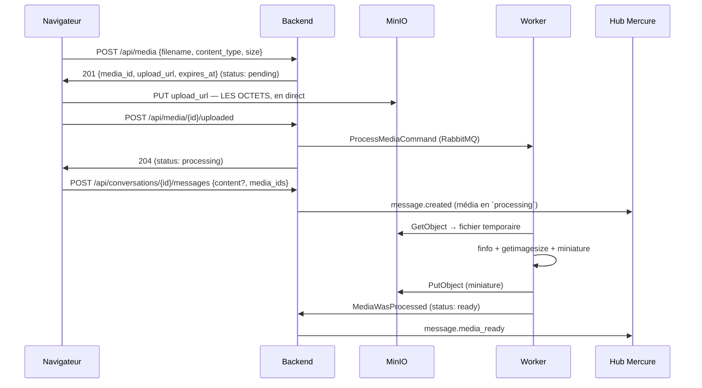

# Instant Messaging — Tranche 4 : pièces jointes

> Sources conceptuelles : [[Médias et aperçus de liens]] (partie A) et [[Dev local - MinIO et URLs
> pré-signées]] du vault Obsidian `tech/InstantMessaging`. Ce document ne réexplique pas les
> concepts — il fige les **décisions d'implémentation** et renvoie aux notes.
>
> Décisions transverses : [ADR 0001](../../adr/0001-cross-context-communication.md). Elles priment
> sur cette spec en cas de divergence.

## Contexte

Les tranches 1 (noyau temps réel + conversations), 2 (accusés de réception et présence) et 3 (cycle
de vie des messages) sont livrées. Un message, aujourd'hui, est **exclusivement textuel**. La
tranche 4 lui permet de porter des images.

### La thèse de la tranche

**Les octets d'un fichier ne transitent jamais par PHP ni par le hub.** Tout le reste de cette spec
découle de cette phrase. Le backend ne fait que trois choses autour d'un média : il **signe** une
autorisation d'écriture, il **inspecte** ce qui a été écrit, il **signe** une autorisation de
lecture. Entre les trois, les octets vont du navigateur au stockage objet et en reviennent, sans
jamais toucher un process applicatif.

La conséquence structurante, et la raison pour laquelle cette tranche est intéressante : **un média
existe avant le message qui le portera**, et il continue d'évoluer après. Ce sont deux cycles de vie
distincts, donc deux contextes bornés.

### La partie B de la note est hors périmètre

La note du vault couvre aussi les **aperçus de liens** (Open Graph, SSRF, cache par URL). Ils ne
partagent avec les pièces jointes ni le stockage objet, ni la surface de sécurité, ni le flux : d'un
côté on signe et on inspecte des octets reçus, de l'autre on émet du trafic sortant vers une URL
choisie par un utilisateur. Une tranche porte une thèse. Les aperçus auront la leur.

### Ce que la tranche ajoute, en une phrase par élément

| Élément | Une phrase |
|---|---|
| **Contexte `Media`** | 6ᵉ contexte borné : possède le stockage objet et le cycle de vie d'un objet téléversé |
| **Upload direct** | le navigateur `PUT` ses octets sur le stockage via une URL pré-signée à TTL court |
| **Inspection asynchrone** | un worker vérifie le type **réel** des octets, mesure l'image et génère une miniature |
| **Attachement** | `Message` possède la liaison message ↔ média, `Media` ignore que les messages existent |
| **Mise à jour temps réel** | `message.media_ready` remplace le placeholder « en cours… » chez tous les membres |

### Décisions prises pendant le design

| Question | Décision | Section |
|---|---|---|
| Aperçus de liens dans cette tranche ? | **non** — tranche à part, aucune surface commune | ci-dessus |
| Quels types de fichiers ? | **images seules** — `jpeg`, `png`, `webp`, `gif` | [§1.3](#13-lallowlist-et-le-plafond) |
| Où vit le média ? | **nouveau contexte `Media`** | [§1.1](#11-pourquoi-un-contexte-à-part) |
| Combien de médias par message ? | **0 à N**, table de liaison possédée par `Message` | [§2.2](#22-message_media-appartient-à-message) |
| Le texte reste-t-il obligatoire ? | **non** — texte **OU** média | [§2.3](#23-linvariant-texte-ou-média-ne-peut-pas-être-un-check) |
| Le message attend-il le traitement ? | **non** — il part `processing` et se met à jour | [§3.5](#35-lordre-des-deux-flux-est-indifférent-et-cest-le-point) |
| Comment le navigateur lit les octets ? | **URL GET pré-signée dans le `MediaView`** | [§4.1](#41-une-url-signée-par-lecture-et-pourquoi-pas-une-redirection) |
| Traitement asynchrone ? | **RabbitMQ + conteneur `worker`** | [§3.4](#34-le-worker) |
| Piège du hostname et CORS ? | **effacés par l'origine unique** — Caddy proxifie le stockage | [§5.2](#52-lorigine-unique-efface-les-deux-pièges-de-la-note) |

---

## Section 1 — Le contexte `Media`

### 1.1 Pourquoi un contexte à part

Un objet stocké a un cycle de vie que rien, dans le domaine du message, ne décrit : il est
**pré-signé** avant d'exister, **téléversé** par quelqu'un qui n'a peut-être pas encore choisi sa
conversation, **inspecté**, éventuellement **refusé**, et parfois **orphelin** — téléversé puis
jamais envoyé. Loger cela dans `Message` donnerait à l'agrégat un second cycle de vie qui n'est pas
le sien.

La spec T1 désignait déjà le service média comme la couture qui aurait un jour son propre cycle de
vie. On ne l'extrait pas en service distinct — [ADR 0001](../../adr/0001-cross-context-communication.md)
et la discipline des contextes bornés suffisent à préparer cette extraction sans la payer
aujourd'hui.

**`Media` ignore totalement l'existence des messages et des conversations.** Il connaît un
propriétaire (`UserId`) et des octets. C'est ce qui rend l'extraction future triviale, et c'est la
propriété qu'il ne faut pas casser.

### 1.2 L'agrégat `MediaObject`

```
Media/Domain/
├── MediaObject.php
├── MediaStatus.php              # enum : Pending, Processing, Ready, Rejected
├── MediaMimeType.php            # enum : l'allowlist, avec values()
├── StorageKey.php               # VO : préfixe + ULID + extension, jamais concaténé ailleurs
├── MediaRepositoryInterface.php
├── MediaNotFoundException.php
└── InvalidMediaTransitionException.php
```

| Champ | Type | Rôle |
|---|---|---|
| `id` | `MediaId` | ULID, ajouté à `Shared/Domain/Identifier/` |
| `ownerId` | `UserId` | le téléverseur — **pas** une conversation |
| `storageKey` | `StorageKey` | clé de l'original dans le bucket |
| `thumbnailKey` | `?StorageKey` | clé de la miniature, `null` avant traitement |
| `status` | `MediaStatus` | `Pending` → `Processing` → `Ready` \| `Rejected` |
| `declaredMimeType` | `MediaMimeType` | ce que le client **prétend** |
| `declaredSize` | `int` | ce que le client **prétend** |
| `mimeType` | `?MediaMimeType` | ce que le serveur a **constaté** |
| `width`, `height`, `byteSize` | `?int` | constatés, `null` avant traitement |
| `createdAt`, `processedAt` | `\DateTimeImmutable`, `?…` | |

Deux colonnes pour le type MIME et deux pour la taille, ce n'est pas une redondance : **le déclaré
sert à filtrer tôt et à signer, le constaté seul fait foi.** Les garder côte à côte rend l'écart
observable — un client qui déclare systématiquement autre chose que ce qu'il envoie est un signal,
et il se loggue en `warning`.

Les transitions sont portées par des méthodes nommées, pas par un `setStatus()` :

```php
MediaObject::request(MediaId, UserId, StorageKey, MediaMimeType $declared, int $declaredSize, \DateTimeImmutable): self  // → Pending
$media->markUploaded(\DateTimeImmutable $now): void            // Pending → Processing, no-op si déjà au-delà
$media->markReady(MediaMimeType, int $w, int $h, int $bytes, StorageKey $thumb, \DateTimeImmutable): void
$media->markRejected(MediaRejectionReason, \DateTimeImmutable): void
```

`markUploaded()` sur un média déjà `Processing` ou `Ready` **ne fait rien et n'enregistre aucun
événement** — même mécanique d'idempotence que `Message::edit()` avec un contenu inchangé, et pour
la même raison : un réessai réseau ne doit pas produire un second traitement. Toute autre transition
illégale (`Ready` → `Processing`) lève `InvalidMediaTransitionException`.

`MediaObject::reconstitute()` n'enregistre aucun domain event, comme `Message::reconstitute()`.

### 1.3 L'allowlist et le plafond

`MediaMimeType` : `image/jpeg`, `image/png`, `image/webp`, `image/gif`. Plafond **10 Mio**.

Les deux valeurs vivent dans le domaine, pas dans la configuration : « quels fichiers cette
messagerie accepte » est une règle métier, au même titre que la fenêtre d'édition de 15 minutes
l'était en T3.

### 1.4 `Rejected` est un état légitime, pas une erreur

Un média refusé — octets qui ne sont pas une image, type réel hors allowlist, taille dépassée,
décodage impossible — reste en base avec sa raison. Le message qui le porte **n'est pas supprimé**
et affiche « fichier refusé ». Effacer le message reviendrait à ce que le serveur retire de
l'historique quelque chose que l'expéditeur croit avoir envoyé.

L'objet stocké, lui, est supprimé du bucket au moment du rejet : on ne conserve pas les octets d'un
fichier qu'on a décidé de ne jamais servir.

---

## Section 2 — Modèle de données

### 2.1 La migration

```sql
CREATE TABLE media_objects (
    id                  CHAR(26)    PRIMARY KEY,
    owner_id            CHAR(26)    NOT NULL REFERENCES users(id),
    storage_key         TEXT        NOT NULL UNIQUE,
    thumbnail_key       TEXT,
    status              TEXT        NOT NULL,
    declared_mime_type  TEXT        NOT NULL,
    declared_size       INTEGER     NOT NULL,
    mime_type           TEXT,
    width               INTEGER,
    height              INTEGER,
    byte_size           INTEGER,
    rejection_reason    TEXT,
    created_at          TIMESTAMPTZ NOT NULL,
    processed_at        TIMESTAMPTZ,

    CONSTRAINT media_ready_is_measured CHECK (
        status <> 'ready'
        OR (mime_type IS NOT NULL AND width IS NOT NULL AND height IS NOT NULL
            AND byte_size IS NOT NULL AND thumbnail_key IS NOT NULL)
    ),
    CONSTRAINT media_rejected_has_reason CHECK (
        status <> 'rejected' OR rejection_reason IS NOT NULL
    )
);

-- Index partiel : la purge des orphelins ne balaie que ce qui n'est pas terminal.
CREATE INDEX media_objects_pending_idx ON media_objects (created_at)
    WHERE status IN ('pending', 'processing');

CREATE TABLE message_media (
    message_id CHAR(26) NOT NULL REFERENCES messages(id) ON DELETE CASCADE,
    media_id   CHAR(26) NOT NULL REFERENCES media_objects(id),
    position   SMALLINT NOT NULL,
    PRIMARY KEY (message_id, media_id),
    -- Un média ne s'attache qu'une fois, à un seul message. C'est la base qui
    -- le garantit, pas un SELECT préalable dans le handler.
    UNIQUE (media_id),
    UNIQUE (message_id, position)
);
```

`media_ready_is_measured` est le pendant du `CHECK` de T3 sur les tombstones : l'invariant « un
média prêt est un média mesuré » vit dans le schéma, et aucun chemin de code ne peut l'enfreindre en
silence.

### 2.2 `message_media` appartient à `Message`

La table de liaison est possédée, migrée et lue par le contexte `Message`. `Media` ne la connaît
pas. C'est le sens de la dépendance : le contexte métier connaît le contexte générique, jamais
l'inverse.

`ON DELETE CASCADE` sur `message_id` mais **pas** sur `media_id` : un média n'est jamais supprimé
tant qu'il est attaché, et supprimer un message pour tous (T3) retire bien la liaison. Le média
orphelin qui en résulte est ramassé par la purge (§7.3).

### 2.3 L'invariant « texte OU média » ne peut pas être un `CHECK`

Il croise deux tables. `messages.content IS NOT NULL OR EXISTS (SELECT … FROM message_media …)` n'est
pas exprimable en contrainte déclarative PostgreSQL, et le rendre exprimable — une colonne
`has_media` dénormalisée — introduirait une valeur qui peut diverger de la vérité.

**L'invariant vit donc dans `Message::send()`**, qui reçoit désormais un `?MessageContent` et une
`list<MediaId>` et refuse les deux vides. Un test fonctionnel le couvre bout en bout.

C'est un affaiblissement assumé par rapport à T3, où le `CHECK` portait l'invariant. Le noter
explicitement vaut mieux que faire semblant : le schéma ne peut pas tout tenir, et prétendre le
contraire par une colonne dénormalisée serait pire.

### 2.4 Ce qui ne change pas

`messages.content` est déjà `NULL`-able depuis T3, donc aucune colonne n'est ajoutée. En revanche le
`CHECK` posé par T3 devient **faux** pour un message image-seule :

```sql
-- T3, à remplacer : équivalence stricte entre « supprimé » et « sans contenu ».
CHECK ((deleted_at IS NULL) = (content IS NOT NULL))
```

Un message qui n'a jamais porté que des images a `content IS NULL` et `deleted_at IS NULL` : il
viole cette équivalence. T4 la relâche en implication :

```sql
ALTER TABLE messages DROP CONSTRAINT messages_tombstone_has_no_payload;
ALTER TABLE messages ADD CONSTRAINT messages_tombstone_has_no_payload
    CHECK (deleted_at IS NULL OR content IS NULL);
```

« Un tombstone n'a pas de contenu » reste garanti. « Un message sans contenu est un tombstone » cesse
de l'être — c'est exactement ce que la tranche rend faux. C'est le seul changement sur la table
`messages`, et il **relâche** une contrainte : aucun risque sur les données existantes.

---

## Section 3 — Le flux, bout en bout

### 3.1 Séquence



### 3.2 Étape 1 — la pré-signature

`POST /api/media` valide le type déclaré contre l'allowlist et la taille contre le plafond, génère
un `MediaId` et une `StorageKey` (`media/{ulid}.{ext}`), enregistre le média en `Pending`, puis
signe une requête `PutObject` à **TTL 5 minutes**.

La signature couvre la méthode, la clé **et** le `Content-Type` : une URL signée pour
`PUT media/01J….jpg` en `image/jpeg` ne permet ni d'écrire ailleurs, ni d'écrire autre chose sous
un autre en-tête déclaré. Elle ne permet pas pour autant d'écrire réellement une image — c'est
l'objet de l'étape 4.

**Une URL pré-signée `PUT` ne peut pas plafonner la taille.** Seule une *POST policy*
(`content-length-range`) le ferait, au prix d'un `multipart/form-data` et d'un flux client tout
autre. Le plafond de 10 Mio est donc appliqué **après** transfert, à l'étape 4, sous forme de rejet.
C'est le compromis de la tranche : on paie un transfert inutile dans le cas pathologique pour garder
un `PUT` simple partout ailleurs.

### 3.3 Étape 3 — la confirmation

`POST /api/media/{mediaId}/uploaded` fait passer `Pending` → `Processing` et publie
`ProcessMediaCommand`. Idempotente par l'agrégat (§1.2), donc rejouable sans condition dans le
contrôleur.

Le backend **ne vérifie pas ici** que l'objet existe dans le bucket. Ce serait un appel réseau
synchrone dans le chemin de la requête pour une information que le worker va de toute façon
chercher : un objet absent devient un `Rejected` avec la raison `missing_object`, comme n'importe
quel autre motif de refus.

### 3.4 Le worker

Un conteneur dédié consomme la file `media` sur RabbitMQ. `ProcessMediaCommandHandler` :

1. `GetObject` **streamé vers un fichier temporaire** — pas en mémoire. 10 Mio en mémoire passerait
   aujourd'hui et ne passerait plus le jour d'une vidéo ; la forme du code ne doit pas dépendre du
   plafond courant.
2. `finfo_file()` sur les octets réels → hors allowlist ⇒ `Rejected`.
3. Taille réelle > plafond ⇒ `Rejected`.
4. `getimagesize()` → échec ⇒ `Rejected`.
5. Miniature 400 px de côté long via `gd`, `PutObject`.
6. `markReady(...)`, `MediaWasProcessed` publié après commit.

Les étapes 2 à 4 sont la raison d'être de cette tranche côté sécurité : **le type déclaré par le
client n'est jamais cru.** Un `.jpg` qui contient du PHP est refusé ici, pas à l'affichage.

Le port `ImageInspectorInterface` (`Media/Application/`) déclare le besoin ; `GdImageInspector`
(`Media/Infrastructure/Image/`) le réalise. `gd` ne remonte donc jamais jusqu'à `Application`, et
l'inspecteur se teste sur de vrais fichiers d'exemple sans conteneur.

Politique de rejeu Messenger : 3 tentatives, délai 1 s, multiplicateur 2. Un échec définitif part en
`failed` et loggue en `error` — le média reste `Processing`, la purge des orphelins le ramassera.

### 3.5 L'ordre des deux flux est indifférent, et c'est le point

Le message et le traitement avancent en parallèle, sans se coordonner :

| Cas | Ce qui se passe | Code nécessaire |
|---|---|---|
| Traitement fini **après** l'envoi | `message.created` porte `processing`, puis `message.media_ready` | la chorégraphie du §6 |
| Traitement fini **avant** l'envoi | aucun message ne référence encore le média : rien n'est publié. `message.created` porte déjà `ready` | **aucun** |

Le second cas n'a pas de `if` : le listener cherche les messages porteurs, n'en trouve aucun, et ne
publie rien. Le comportement correct tombe de la requête, pas d'une condition.

---

## Section 4 — Lecture des médias

### 4.1 Une URL signée par lecture, et pourquoi pas une redirection

Chaque `MediaView` rendu par une lecture de messages porte deux URLs `GET` pré-signées à **TTL 15
minutes** : l'original et la miniature. Le front pose un `` direct — **PHP reste hors du
chemin des octets, en lecture comme en écriture.**

L'alternative — une route `GET /api/media/{id}/content` qui répond 302 vers une URL fraîche —
donnerait au front un `src` stable et jamais expiré. Elle est écartée : elle remet PHP sur le chemin
d'une requête par image et par scroll, et un 302 se cache mal côté navigateur. On réintroduirait
exactement le maillon que la tranche existe pour supprimer.

Contrepartie assumée : **une URL expire dans un onglet resté ouvert.** Le front recharge la page de
messages sur `onError` d'une image (§8). C'est une ligne de code contre un maillon d'architecture.

### 4.2 Qui a le droit d'obtenir une URL

La signature n'est émise que si le demandeur est **membre de la conversation** d'un message porteur
— vérification par le contrat publié `ConversationMembershipInterface`, comme partout ailleurs. Un
média non encore attaché n'est lisible que par son propriétaire.

Aucune route dédiée n'expose cette signature : les URLs ne sortent que **dans** une réponse dont
l'appartenance a déjà été vérifiée. Il n'y a donc pas de surface « donne-moi une URL pour ce
média » à protéger séparément — la protection est celle de la conversation.

### 4.3 Un média `processing` ou `rejected` ne porte aucune URL

`url`, `thumbnail_url`, `mime_type`, `width` et `height` sont `null` tant que le statut n'est pas
`ready`. On ne signe pas l'accès à des octets qu'on n'a pas encore validés.

---

## Section 5 — Stockage objet et infrastructure

### 5.1 Deux clients S3, et c'est délibéré

| Client | Endpoint | Usage |
|---|---|---|
| `media.s3.internal` | `http://minio:9000` | `GetObject` / `PutObject` / `DeleteObject` du worker et de la purge |
| `media.s3.signer` | `http://localhost:8080` | **uniquement** `createPresignedRequest()` |

Une URL pré-signée signe le `Host`. Le client interne signe ses propres requêtes avec l'hôte qu'il
appelle vraiment : aucun problème. Le client signeur, lui, doit signer avec **l'hôte que le
navigateur appellera**, sinon `SignatureDoesNotMatch`. D'où deux instances, et un seul adaptateur
`S3MediaStorage` qui sait laquelle utiliser pour quoi.

`use_path_style_endpoint: true` des deux côtés — la seule ligne à changer le jour d'un vrai S3.

### 5.2 L'origine unique efface les deux pièges de la note

La note du vault recommande d'ajouter `127.0.0.1 minio` dans le `/etc/hosts` de la machine hôte
(piège n°1, hostname) puis de configurer CORS sur le bucket (piège n°2). **Ni l'un ni l'autre n'est
nécessaire ici**, et c'est l'architecture de T1 qui l'offre gratuitement.

Caddy est déjà l'origine unique du projet. On lui ajoute une route :

```caddyfile
handle /messaging-media/* {
    reverse_proxy minio:9000
}
```

Caddy préserve le `Host` d'origine par défaut. Le backend signe donc avec
`http://localhost:8080/messaging-media/…` — l'hôte que le navigateur appelle réellement, donc
signature valide — et le `PUT` devient **same-origin** : plus de preflight, plus de règle CORS,
plus de fichier `cors.json`, plus de modification du `/etc/hosts` de Nicolas.

Le nom du bucket sert de préfixe de chemin, ce que le *path-style endpoint* donne déjà : `minio`
reçoit `/messaging-media/media/01J….jpg` et y lit le bucket `messaging-media` puis la clé
`media/01J….jpg`. Aucune réécriture d'URL — donc aucune signature cassée.

### 5.3 Les conteneurs

| Service | Rôle |
|---|---|
| `minio` | stockage objet, console web sur `:9001` pour **voir les objets arriver** |
| `createbucket` | one-shot `mc mb` au démarrage, `mc anonymous set none` |
| `rabbitmq` | file durable, `rabbitmq.conf` + `definitions.json` montés en `ro` |
| `worker` | `messenger:consume media --time-limit=3600`, `restart: unless-stopped` |

RabbitMQ suit le patron de `book.it` : les files et exchanges sont déclarés dans `definitions.json`
chargé au boot, et le transport Messenger est en `auto_setup: false`. La topologie est une décision
d'infrastructure versionnée, pas quelque chose que l'application improvise au premier message.

Redis n'est **pas** utilisé pour cette file, malgré sa présence : il est délibérément sans volume
(présence éphémère, cf. `compose.yaml`). Une file de traitement perdue au redémarrage laisserait des
médias bloqués en « en cours… » pour toujours.

### 5.4 Paquets et extensions

Ajoutés à `composer.json` :

| Paquet | Rôle |
|---|---|
| `aws/aws-sdk-php` | client S3 / MinIO, pré-signature |
| `symfony/amqp-messenger` | transport RabbitMQ |
| `zenstruck/messenger-test` (dev) | asserter qu'un message part, sans le consommer |

Extensions ajoutées au `install-php-extensions` du `Dockerfile` **et** déclarées en `"ext-…": "*"` :
`amqp` (transport), `gd` (mesure et miniature), `fileinfo` (type réel). Déclarer les trois dans
`composer.json` rend la dépendance vérifiable par `composer check-platform-reqs` au lieu de tomber à
l'exécution.

---

## Section 6 — Temps réel et chorégraphie

### 6.1 Trois sauts, aucun contexte ne pilote l'autre

```
Media    →  MediaWasProcessed          (Shared/Domain/Event/, scalaires seuls)
Message  →  MessageMediaBecameReady    (un par message porteur)
Realtime →  message.media_ready        (topic de la conversation)
```

`Media` ne sait pas ce qu'est une conversation : son événement ne peut donc pas nommer de topic.
`Message` sait quels messages portent le média et dans quel fil ils vivent : c'est lui qui traduit.
`Realtime` publie. Chacun réagit à un fait, aucun n'appelle le use case d'un autre — c'est la
chorégraphie de l'ADR 0001, appliquée telle quelle.

Charge utile de `MediaWasProcessed` : `media_id`, `status`, `mime_type`, `width`, `height`,
`byte_size` — **des scalaires uniquement**, sinon `Shared` dépendrait de `Media`. Ni `StorageKey`,
ni URL signée : une URL a une durée de vie de 15 minutes, la mettre dans un événement serait y
mettre quelque chose de périmable.

### 6.2 L'événement Mercure

```json
{
  "message_id": "01J…",
  "conversation_id": "01J…",
  "media": { "id": "01J…", "status": "ready", "mime_type": "image/jpeg",
             "width": 1600, "height": 900, "url": "…", "thumbnail_url": "…" }
}
```

**Aucun `id` d'événement Mercure fourni par le publieur**, conformément à la décision de T3 (§4.2 de
cette spec-là) : l'ULID du message est déjà l'`id` de `message.created`, le réutiliser ferait deux
événements distincts sous un même `Last-Event-ID`.

### 6.3 Publication après commit, y compris dans le worker

Le worker consomme par le même `command.bus`, donc le même `TransactionalMiddleware` : `markReady()`
est commité avant que `MediaWasProcessed` soit dispatché. Aucun code spécifique au worker — c'est le
bénéfice de n'avoir qu'un seul bus de commandes.

---

## Section 7 — Cycle de vie côté serveur

### 7.1 Le rejet supprime les octets

`markRejected()` déclenche, dans le même handler, un `DeleteObject` sur l'original. La ligne reste,
les octets partent.

### 7.2 La suppression d'un message ne supprime pas le média

T3 a posé « record soft, payload hard » pour le texte, et « pour tous » y **vide** `content` sans
supprimer la ligne `messages`. Le `ON DELETE CASCADE` de `message_media` ne se déclenche donc
jamais : il est là pour un hard delete que le projet ne pratique pas.

La liaison doit par conséquent être **explicitement retirée** par `Message::deleteForEveryone()`, qui
gagne cette responsabilité. Le média devient orphelin et part à la purge : les octets sont détruits,
comme le texte l'était.

C'est le seul endroit où T4 modifie un comportement de T3. Sans ce retrait, supprimer un message
laisserait ses images intégralement accessibles à quiconque relit la conversation — le pire des deux
mondes, une suppression qui a l'air d'avoir eu lieu.

### 7.3 La purge des orphelins

Commande console `media:purge-orphans` (`Media/Infrastructure/Console/`) : supprime les objets et
les lignes des médias non attachés dont le statut n'est pas terminal depuis plus de **24 h**, ainsi
que les `Ready` non attachés de plus de 24 h.

Lancée à la main pour l'instant — pas de planificateur dans le projet, et en ajouter un pour une
seule commande serait de l'infrastructure non justifiée. La commande loggue en `notice` le nombre
d'objets supprimés.

---

## Section 8 — API HTTP

### 8.1 Les routes

| Route | Corps | Réponse |
|---|---|---|
| `POST /api/media` | `{filename, content_type, size}` | **201** `{media_id, upload_url, expires_at}` |
| `POST /api/media/{mediaId}/uploaded` | — | **204**, idempotente |
| `POST /api/conversations/{id}/messages` | `+ media_ids[]`, `content` optionnel | inchangée : **201**/**200** |
| `GET /api/conversations/{id}/messages` | — | chaque message gagne `media: []` |

### 8.2 Les payloads

`PresignUploadPayload` : `content_type` en `Assert\Choice(MediaMimeType::values())` — la contrainte
**référence** l'enum, elle ne redéclare pas la liste. `size` en `Positive` +
`LessThanOrEqual(MediaObject::MAX_BYTES)`. `filename` sert uniquement à déduire l'extension de la
clé de stockage ; il n'est jamais renvoyé au client ni utilisé comme chemin.

`SendMessagePayload` gagne `media_ids` en `All(Regex(AbstractUlidIdentifier::PATTERN))` +
`Count(max: 10)`, et `content` **perd son `NotBlank`**.

La règle « texte OU média » croise deux champs : elle ne peut pas être une contrainte de champ. Elle
reste dans le contrôleur et lève une `InvalidInputExceptionInterface`, exactement comme « un groupe
requiert un titre » en T1.

### 8.3 Deux entrées au catalogue RFC 7807

| Exception | Statut | `type` |
|---|---|---|
| `MediaNotOwnedException` | **403** | `/problems/media-not-owned` |
| `MediaAlreadyAttachedException` | **409** | `/problems/media-already-attached` |

Elles implémentent `ForbiddenExceptionInterface` et `ConflictExceptionInterface` : le
`ProblemDetailsListener` n'est pas modifié.

Un `media_id` **inexistant** rend **404 `/problems/resource-not-found`**, indistinguable d'un média
appartenant à quelqu'un d'autre qui n'existe pas. Un type hors allowlist sort déjà en
`validation-failed` par la contrainte `Choice` — aucune entrée nouvelle.

### 8.4 Le contrat publié de `Media`

```
Media/Application/Contract/
├── MediaOwnershipInterface.php   # « ce média appartient-il à cette personne et est-il libre ? »
├── MediaFinderInterface.php      # « donne-moi les MediaView de ces ids, signés pour ce lecteur »
└── MediaView.php
```

`MediaView` : `id`, `status`, `mime_type`, `width`, `height`, `url`, `thumbnail_url`. **Modifier
cette forme est un changement cassant** pour `Message` et pour le front.

`MediaOwnershipInterface` ne rend qu'un booléen par média — jamais l'agrégat, jamais le propriétaire.
Un consommateur ne doit rien pouvoir déduire de plus que ce qu'il a demandé.

---

## Section 9 — Front

| Fichier | Contenu |
|---|---|
| `api/types.ts` | `ApiMedia`, et `media: ApiMedia[]` sur `ApiMessage` |
| `api/client.ts` | `presignUpload()`, `confirmUpload()` |
| `api/upload.ts` | **nouveau** — le `PUT` brut des octets |
| `store/messagesReducer.ts` | `StoredMessage.media`, action `MEDIA_READY` |
| `hooks/useMediaUpload.ts` | **nouveau** — sélection → pré-signature → `PUT` → confirmation |
| `ui/Composer.tsx` | bouton fichier, vignettes en attente, retrait avant envoi |
| `ui/MessageMedia.tsx` | **nouveau** — les trois états d'affichage |

**Le `PUT` des octets vit à part du client HTTP typé**, et le commentaire doit le dire : il ne vise
pas notre API, ne doit pas porter nos cookies de session, et ne rend pas de *Problem Details*. Le
faire passer par `client.ts` mélangerait deux protocoles sous une même abstraction.

`useMediaUpload` porte l'aperçu local via `URL.createObjectURL`, affiché tant que le serveur n'a rien
à rendre. **Sa révocation sera commentée largement** : un `objectURL` non révoqué retient le fichier
entier en mémoire tant que l'onglet vit, et c'est la fuite classique de ce motif. Nicolas est novice
côté front — ce commentaire compte autant que le code.

`MessageMedia` rend trois états : `processing` (placeholder aux proportions mesurées côté client si
connues, carré sinon — pour que la liste ne saute pas quand l'image arrive), `ready` (miniature
cliquable vers l'original), `rejected` (« fichier refusé »).

`onError` sur une image recharge la page de messages : contrepartie du §4.1, et le commentaire doit
dire que l'erreur attendue est une **expiration**, pas une image cassée.

---

## Section 10 — Tests

| Niveau | Couverture |
|---|---|
| Unitaire domaine | transitions de `MediaObject`, no-op de `markUploaded()`, transitions illégales, `StorageKey` |
| Unitaire inspection | `GdImageInspector` sur de vrais fichiers : JPEG valide, PHP renommé `.jpg`, GIF tronqué, image de 12 Mio |
| Unitaire front | `messagesReducer` — `MEDIA_READY` sur un message présent, absent, déjà `ready` |
| Fonctionnel | flux complet contre un MinIO éphémère (`compose.test.yaml`) : pré-signature, `PUT`, confirmation, traitement, envoi, lecture |
| Fonctionnel | attacher le média d'un autre → 403 ; attacher deux fois → 409 ; média inconnu → 404 |
| Fonctionnel | message sans texte **ni** média → 422 ; message sans texte **avec** média → 201 |
| Messenger | `zenstruck/messenger-test` : `ProcessMediaCommand` part à la confirmation, **une seule fois** sur rejeu |
| Publication | `EventPublisher` espion : topic **et** charge utile de `message.media_ready`, notamment qu'aucune clé de stockage n'y figure |

Aucun hub Mercure ni RabbitMQ réel n'est nécessaire en CI : le transport passe en `in-memory://` sous
`when@test`, comme dans `book.it`.

---

## Section 11 — Découpage en commits

**Une seule branche `feat/tranche-4-medias`**, avec des commits relisibles dans cet ordre. Chacun
laisse `make test`, `make static-code-analysis`, `make check-cs` et `make deptrac` verts.

| # | Commit | Contenu |
|---|---|---|
| 1 | `docs(medias)` | cette spec |
| 2 | `chore(medias)` | paquets, extensions du `Dockerfile`, `minio`, `rabbitmq`, `worker`, route Caddy, deptrac |
| 3 | `feat(medias)` | contexte `Media` : agrégat, migration, repository, `POST /api/media` et `/uploaded` |
| 4 | `feat(medias)` | worker : `ProcessMediaCommand`, inspection, miniature, `Ready`/`Rejected`, `MediaWasProcessed` |
| 5 | `feat(message)` | `message_media`, contrat `MediaOwnership`, envoi avec médias, invariant texte-ou-média |
| 6 | `feat(message)` | `MediaView` signé dans `MessageView`, lecture de page, retrait de la liaison à la suppression (§7.2) |
| 7 | `feat(realtime)` | chorégraphie `MessageMediaBecameReady` → `message.media_ready` |
| 8 | `feat(front)` | types, client, `useMediaUpload`, compositeur |
| 9 | `feat(front)` | `MessageMedia`, les trois états, `MEDIA_READY` dans le reducer |
| 10 | `chore(medias)` | `media:purge-orphans` |
| 11 | `docs(medias)` | `README`, `CLAUDE.md` (6ᵉ contexte, conteneurs), plan d'implémentation clos |

Le commit 2 est délibérément inerte : il porte à lui seul tout le changement d'infrastructure, ce qui
rend les neuf suivants lisibles comme du code applicatif.

---

## Section 12 — Hors périmètre, explicitement

Aperçus de liens et unfurling, avec toute la défense SSRF — tranche à part · vidéo, audio et
documents · plusieurs résolutions et *responsive images* · CDN et cache long · analyse antivirus ·
quotas de stockage par utilisateur · *resumable uploads* · chiffrement au repos et de bout en bout ·
*POST policy* pour plafonner la taille au transfert (§3.2) · réordonnancement des médias d'un message
après envoi · téléchargement de l'original sous son nom de fichier d'origine · planificateur pour la
purge (§7.3) · rejeu manuel d'un traitement échoué depuis l'interface.

---

## Critères d'acceptation de la tranche 4

1. Alice choisit une image ; les octets partent **directement** sur MinIO — aucune trace de la charge
   utile dans les logs du backend, et l'objet apparaît dans la console MinIO à `localhost:9001`.
2. Le message d'Alice s'affiche chez Bob **immédiatement**, avec un placeholder, puis l'image
   apparaît **sans rafraîchir**.
3. Un fichier PHP renommé `photo.jpg` est accepté au transfert et refusé au traitement : les deux
   voient « fichier refusé », et l'objet a disparu du bucket.
4. Un message sans texte ni image rend 422 ; un message sans texte avec une image rend 201.
5. Attacher le média d'un autre rend 403 `/problems/media-not-owned` ; l'attacher deux fois rend 409.
6. Carol, non membre de la conversation, n'obtient aucune URL signée — et l'URL récupérée par Bob
   cesse de fonctionner passé 15 minutes.
7. Rejouer `POST /api/media/{id}/uploaded` rend 204 et ne produit **aucun** second traitement.
8. Supprimer pour tous un message porteur d'images rend ces images inaccessibles.
9. `docker compose restart rabbitmq` en plein traitement ne perd aucun média : la file est durable.
10. Les quatre portes de qualité sont vertes.

## Questions restées ouvertes

Aucune.
